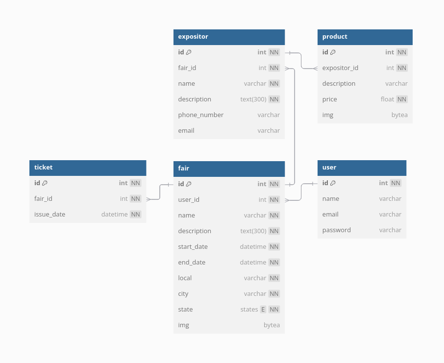

# Projeto físico de banco de dados

O projeto de banco de dados relacional para suporte às operações do sistema **YandêHUB** foi executado utilizando o aplicativo *web* <a href="https://docs.dbdiagram.io/" target="_blank">dbdiagram</a>. Essa ferramenta permite a criação de diagramas de banco de dados relacional (ERDs, do inglês *entity-relationship diagram*) para modelagem lógica. O diagrama construído é apresentado abaixo. Detalhes adicionais podem ser visualizados na <a href="https://dbdocs.io/gscolombo404/YandeHUB" target="_blank">página do projeto no **dbdocs**</a>.



Como especificado no [documento de arquitetura do sistema](system_architecture.md), o sistema de gerenciamento de banco de dados utilizado em ambiente de produção será o [**PostgreSQL**](https://www.postgresql.org/). Porém, em ambiente de desenvolvimento, o banco de dados **SQLite** inicializado pelo *framework* **Django** poderá ser utilizado. O **dbdiagram** facilita a inicialização do banco de dados no **PostgreSQL**, disponibilizando o código SQL para criação das colunas associadas a um banco de dados no SGDB, apresentado abaixo.

```sql
CREATE TYPE "states" AS ENUM (
  'AC',
  'AL',
  'AP',
  'AM',
  'BA',
  'CE',
  'DF',
  'ES',
  'GO',
  'MA',
  'MT',
  'MS',
  'MG',
  'PA',
  'PB',
  'PE',
  'PI',
  'PR',
  'RJ',
  'RN',
  'RO',
  'RS',
  'RR',
  'SE',
  'SC',
  'SP',
  'TO'
);

CREATE TABLE "user" (
  "id" INT GENERATED BY DEFAULT AS IDENTITY UNIQUE PRIMARY KEY NOT NULL,
  "name" varchar,
  "email" varchar,
  "password" varchar
);

CREATE TABLE "fair" (
  "id" INT GENERATED BY DEFAULT AS IDENTITY UNIQUE PRIMARY KEY NOT NULL,
  "user_id" int NOT NULL,
  "name" varchar UNIQUE NOT NULL,
  "description" text(300) NOT NULL,
  "start_date" datetime NOT NULL,
  "end_date" datetime NOT NULL,
  "local" varchar NOT NULL,
  "city" varchar NOT NULL,
  "state" states NOT NULL,
  "img" bytea
);

CREATE TABLE "expositor" (
  "id" INT GENERATED BY DEFAULT AS IDENTITY UNIQUE PRIMARY KEY NOT NULL,
  "fair_id" int NOT NULL,
  "name" varchar NOT NULL,
  "description" text(300) NOT NULL,
  "phone_number" varchar,
  "email" varchar
);

CREATE TABLE "product" (
  "id" INT GENERATED BY DEFAULT AS IDENTITY UNIQUE PRIMARY KEY NOT NULL,
  "expositor_id" int NOT NULL,
  "description" varchar,
  "price" float NOT NULL
);

CREATE TABLE "ticket" (
  "id" INT GENERATED BY DEFAULT AS IDENTITY UNIQUE PRIMARY KEY NOT NULL,
  "fair_id" int NOT NULL,
  "issue_date" datetime NOT NULL
);

ALTER TABLE "fair" ADD FOREIGN KEY ("user_id") REFERENCES "user" ("id");

ALTER TABLE "expositor" ADD FOREIGN KEY ("fair_id") REFERENCES "fair" ("id");

ALTER TABLE "product" ADD FOREIGN KEY ("expositor_id") REFERENCES "expositor" ("id");

ALTER TABLE "ticket" ADD FOREIGN KEY ("fair_id") REFERENCES "fair" ("id");
```

Espera-se que a implantação do banco de dados seja realizada em uma máquina ou contâiner separada da aplicação principal, a fim de assegurar recursos de memória/processamento e prover maior segurança de dados e acesso. A instalação do servidor **PostgreSQL** seria realizada nesse nó, no qual seria criado o banco de dados para o *software* **YandêHUB** e o código acima seria utilizado para inicializar as tabelas necessários ao sistema.